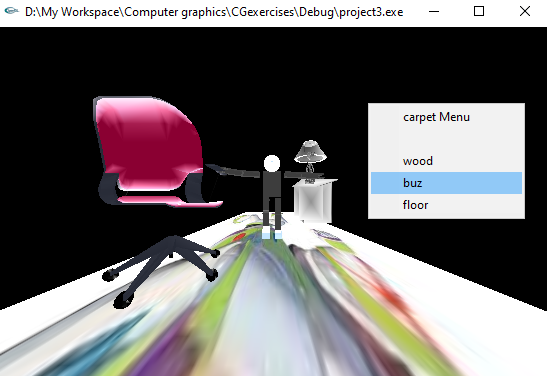
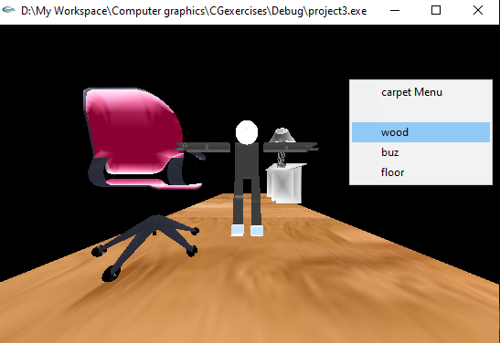
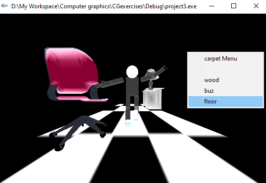
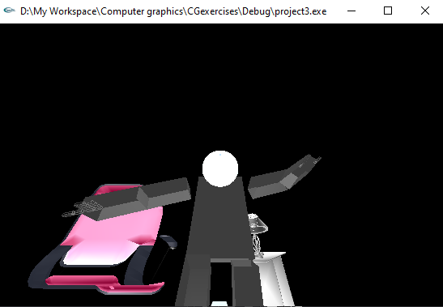
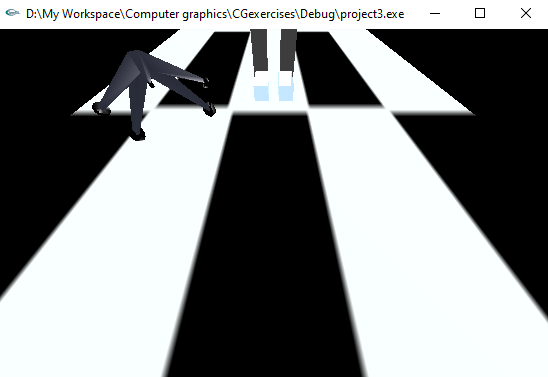
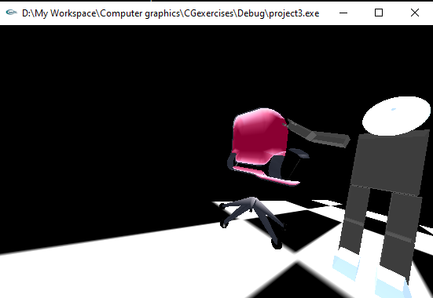
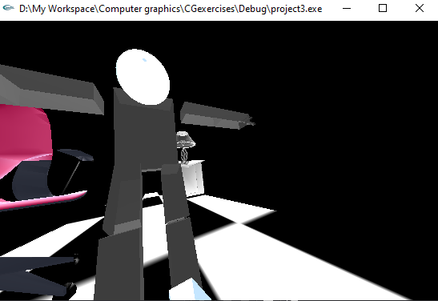
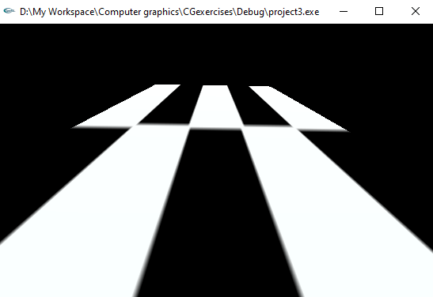
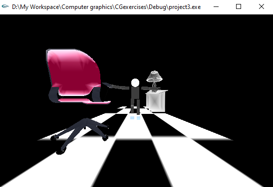
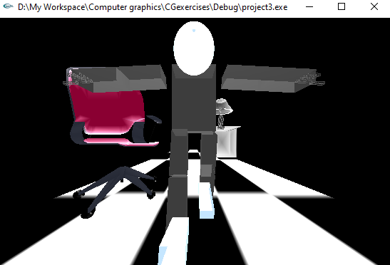

# extended full body model

this project is an extension of <a href="https://github.com/HassanHosniAbdelalem/ROBOT">this</a> repository

### what's new?
* Object animation.
* texture mapping
* loading external objects.
* lighting and coloring

we made an animation movement for our body object and setup a surrounding environment (e.g. carpet, lamp, officeChair...) then applied two light sources and lighting effects on the scene and controled the texture mapping of some objects like the carpet with attached small menu (opened with right click), all the view controls of the previous project are also included (e.g. zooming in/out, looking up/down, looking left/right, reshaping the window...)

<style>
    .flex-container {
    display: flex;
    flex-direction: row;
    justify-content: center;
    }
    .flex-container > div {
    margin: 10px;
    height: 300px;
    width: 300px;
    }
</style>

## Sample Results
### texturing and menu
<div class="flex-container">
  <div></div>
  <div></div>
  <div></div> 
</div>

### camera and viewing
<div class="flex-container">
  <div></div>
  <div></div>
  <div></div>
</div>
<div class="flex-container">
  <div></div> 
  <div></div> 
</div>
### animation and interaction
<div class="flex-container">
  <div></div>
  <div></div>
</div>

## members contributions on this part of project

member | contribution
--------| ---------------
Yousof mahmoud elhely | implemented integration of the project, fixed some bugs and writed the report
Ahmed mohamed mohamed | implemented coloring, loading external objects and fixed some bugs
Hassan hosni abdelalem | implemented object animations, lighting and texture mapping and it's control

## issues we faced
* there was multiple issues during the development of the appication, all was solved with dedication and good understanding of the glut flow and concepts

* only One issue solution that **stack overflow** credit, it's that the ```const char* name``` can't be assigned to ```char* argument``` in **glm** library so we used ```char name[] = "whatever we want to pass"``` to pass our string to glm function arguments 

