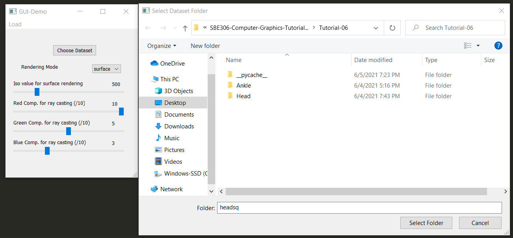
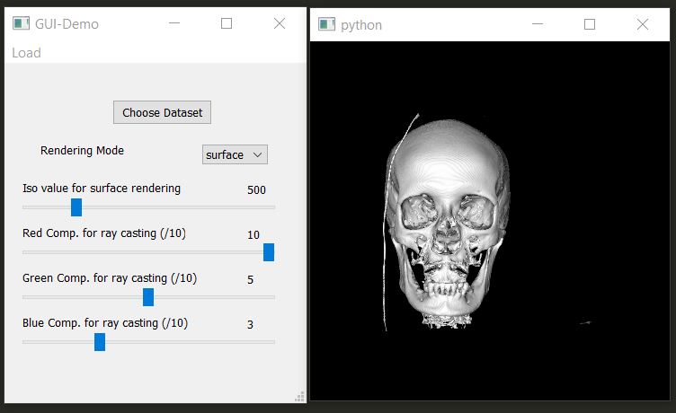
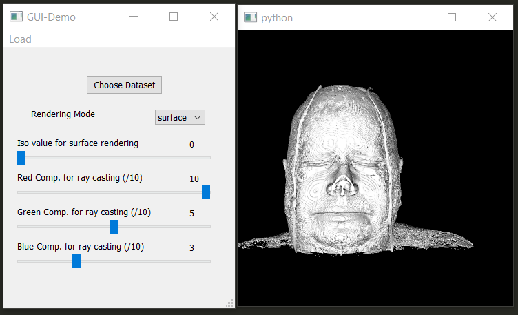
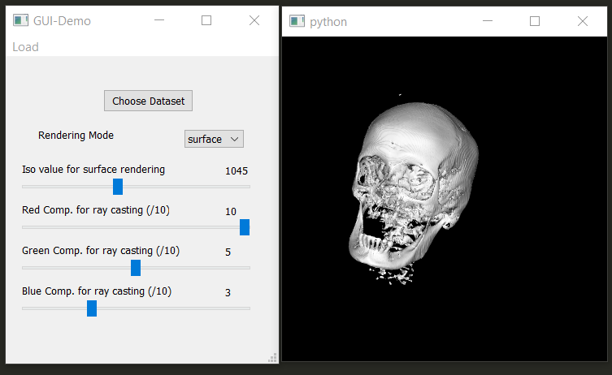
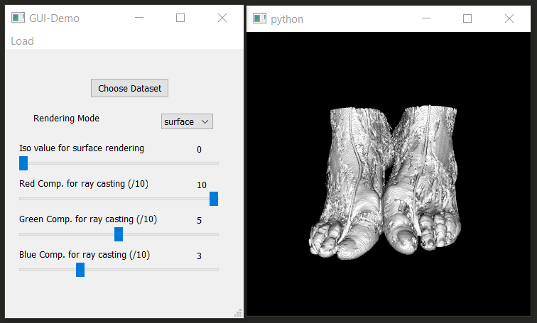
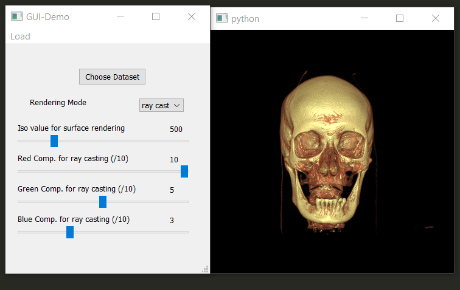
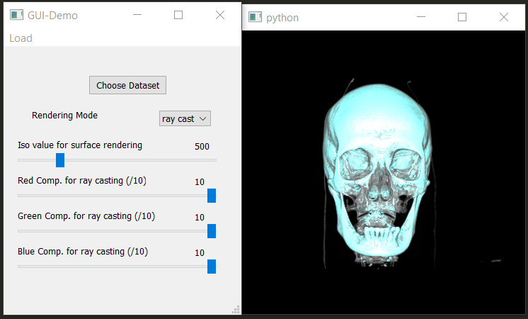
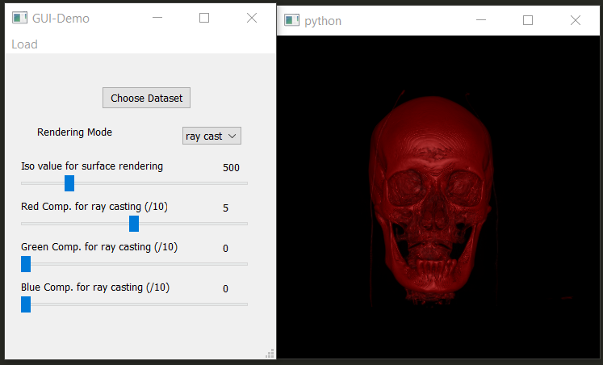
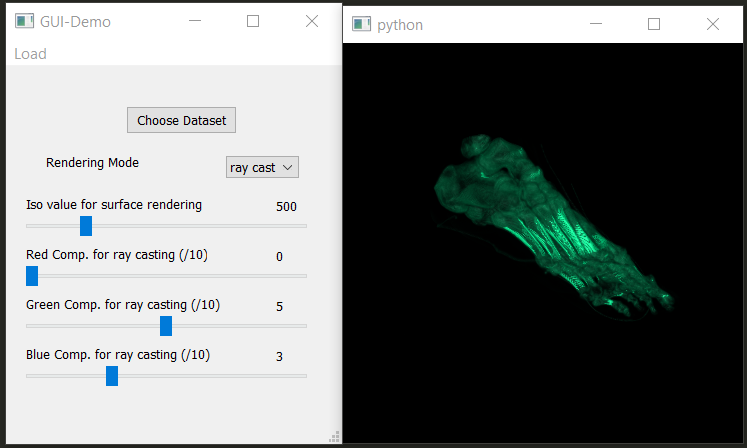

# Assignment 3: Texture, Models & Medical Visualization PART #2 Report


## Screenshots
---------
### Choosing the dataset to render

### Rendering the head dataset (ISO = 500 and reder mode = surface by default)

### ISO value = 0 (showing skin) for the rendered head

### ISO value = 1045 for the rendered head in surface rendering mode

### Choosing ankle dataset to be rendered and settting ISO valueto 0

### Changing rendering mode to ray casting for the rendered head (RGB = (1.0, 0.5, 0.3) by default)

### Setting RGB to (1.0, 1.0, 1.0) for the rendered head in ray casting redering mode

### Setting RGB to (0.5, 0.0, 0.0) for the rendered head in ray casting redering mode

### Setting RGB to (0.0, 0.5, 0.3) for the rendered ankle in ray casting redering mode


## Code Snippits
---------
- `open_folder` Function
```python
def open_folder():
    global dataDir
    options =  QtWidgets.QFileDialog.Options()
    dataDir = QtWidgets.QFileDialog.getExistingDirectory(caption = "Select Dataset Folder",options=options)

    if dataDir != '': #Directory Specified

        if ui.comboBox.currentIndex == 0: #Surface rendering selected

            ui.horizontalSlider.setValue(500); ui.label_2.setNum(500)
            slider_SLOT(500)


        else: #Ray casting rendering selected

            ui.horizontalSlider_2.setValue(10); ui.label_5.setNum(10)
            ui.horizontalSlider_3.setValue(5) ; ui.label_7.setNum(5)
            ui.horizontalSlider_4.setValue(3); ui.label_9.setNum(3)
            iren.update()


        vtk_rendering()
    else:
        pass

```
> This function is responsible for getting the folder of the dataset and then checking on the rendering mode by getting the value of the comboBox and based on the rendering mode initialize the slider(s) used in that mode.
-----
2- In `vtk_rendering` Function

```python
    reader = vtk.vtkDICOMImageReader()
    reader.SetDirectoryName(dataDir)
    reader.Update()
```
> This part of the function is used to read the medical images in (`.dcm`) format as a series which is the used to rendered volume.

```python
    if ui.comboBox.currentIndex() == 0: #Surface rendering selected

        surfaceExtractor.SetInputConnection(reader.GetOutputPort())
        surfaceExtractor.SetValue(0, 500)
        surfaceNormals = vtk.vtkPolyDataNormals()
        surfaceNormals.SetInputConnection(surfaceExtractor.GetOutputPort())
        surfaceNormals.SetFeatureAngle(60.0)

        surfaceMapper = vtk.vtkPolyDataMapper()
        surfaceMapper.SetInputConnection(surfaceNormals.GetOutputPort())
        surfaceMapper.ScalarVisibilityOff()
        surface = vtk.vtkActor()
        surface.SetMapper(surfaceMapper)

        aRenderer.AddActor(surface)
```
> This part of the function is used to render the volumn in a surface rendering if the mode was selected from the comboBox.

``` Python
    else: #Ray casting rendering selected
        volumeMapper = vtk.vtkGPUVolumeRayCastMapper()
        volumeMapper.SetInputConnection(reader.GetOutputPort())
        volumeMapper.SetBlendModeToComposite()

        volumeColor = vtk.vtkColorTransferFunction()
        volumeColor.AddRGBPoint(0,    0.0, 0.0, 0.0)
        volumeColor.AddRGBPoint(500,  ui.horizontalSlider_2.value()/10, ui.horizontalSlider_3.value()/10, ui.horizontalSlider_4.value()/10)
        volumeColor.AddRGBPoint(1000, ui.horizontalSlider_2.value()/10, ui.horizontalSlider_3.value()/10, ui.horizontalSlider_4.value()/10)
        volumeColor.AddRGBPoint(1150, ui.horizontalSlider_2.value()/10, 2 * ui.horizontalSlider_3.value()/10, 2 * ui.horizontalSlider_4.value()/10)

        volumeScalarOpacity = vtk.vtkPiecewiseFunction()
        volumeScalarOpacity.AddPoint(0,    0.00)
        volumeScalarOpacity.AddPoint(500,  0.15)
        volumeScalarOpacity.AddPoint(1000, 0.15)
        volumeScalarOpacity.AddPoint(1150, 0.85)

        volumeGradientOpacity = vtk.vtkPiecewiseFunction()
        volumeGradientOpacity.AddPoint(0,   0.0)
        volumeGradientOpacity.AddPoint(90,  0.5)
        volumeGradientOpacity.AddPoint(100, 1.0)

        volumeProperty = vtk.vtkVolumeProperty()
        volumeProperty.SetColor(volumeColor)
        volumeProperty.SetScalarOpacity(volumeScalarOpacity)
        volumeProperty.SetGradientOpacity(volumeGradientOpacity)
        volumeProperty.SetInterpolationTypeToLinear()
        volumeProperty.ShadeOn()
        volumeProperty.SetAmbient(0.4)
        volumeProperty.SetDiffuse(0.6)
        volumeProperty.SetSpecular(0.2)

        volume = vtk.vtkVolume()
        volume.SetMapper(volumeMapper)
        volume.SetProperty(volumeProperty)

        aRenderer.AddViewProp(volume)
```
> This part of the function is used to render the volumn in a ray casting rendering if this mode was selected from the comboBox.


## Issues
-----
- couldn't set the step in the RGB sliders to be 0.1 since the range for each slider is from 0 to 1, instead we changed the range to be form 0 to 10 and with a step equal to 1, then divide the current values of the sliders by 10 when using them in `AddRGBPoint()` function, so if the green comp. slider value is 5 initially this means that the green component is 0.5 initially.
